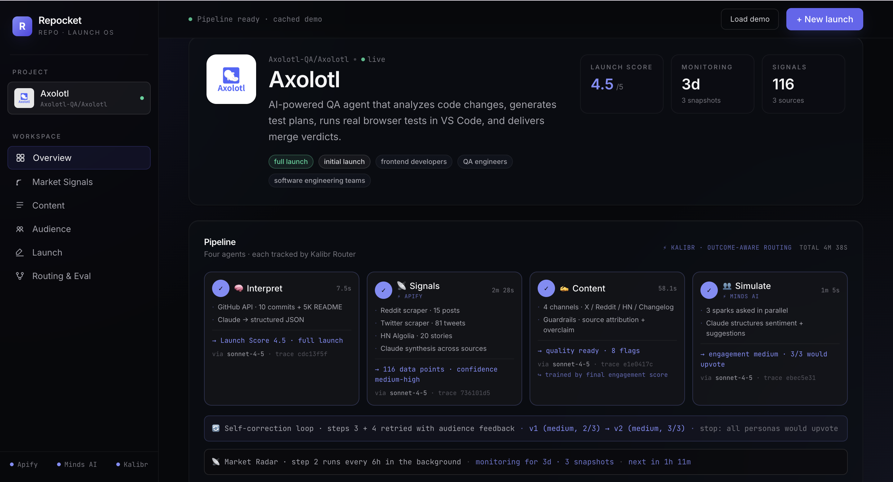

<div align="center">

# Repocket

### Every push is a launch, waiting to happen.

*repo + rocket · pocket-sized GTM operator for anyone with a git repo*

</div>



<div align="center">

**▶ [Watch the live walkthrough](https://screen.studio/share/BIcqdVCl)** · full end-to-end demo, no local setup

</div>

---

## The problem

**Every tech company already has a built-in marketing pipeline — their own repo — and they aren't using it.**

You ship a feature. A commit lands. A changelog updates. A repo grows. And then — silence. No tweet, no Reddit post, no HN submission. The artifact the entire company is built around gets shipped into the void, because "marketing" is someone else's job, and that someone doesn't exist yet.

In tech, **the repo is the ground truth**. Every push is an opportunity to reach your users. Most die on arrival — not because the work isn't good, but because no one has the time to turn it into a post, match it to the right subreddit, test the message, and hit publish at the right hour.

Solo founders, indie hackers, early-stage startups, engineering teams at mature companies — all of them ship more code than attention. Repocket closes that gap.

---

## The solution

Paste a GitHub URL. Repocket reads your code, scrapes the live conversation on Reddit / X / Hacker News, drafts tone-tuned copy for every channel, **simulates how three AI personas will react before it publishes**, revises the draft until it converges, and hands you approved, source-attributed content — plus a routing policy that gets smarter with every launch you run.

**Then it never stops watching.** After first setup, Repocket sits on your repo and the market simultaneously. When you push a commit that looks marketing-worthy — a feature, a breaking improvement, a meaningful release — it surfaces a ready-drafted launch with persona feedback already attached, so you can approve-and-ship in one click instead of staring at a blank post field wondering *should I even post this?*

It's a GTM operating system. Paste once, monitor forever, launch every time you push.

---

## How it works

```
GitHub URL
    │
    ▼
┌──────────────────┐  GitHub API · 10 commits · 5 kB README
│   Interpreter    │─────────────────────────────────────▶  product understanding + Launch Score + keywords
└──────────────────┘
    │
    ▼
┌──────────────────┐  Apify Reddit · Apify X · HN Algolia
│  Signal Scout    │─────────────────────────────────────▶  75+ grounded data points · trending narrative
└──────────────────┘                                               ▲
    │                                                              │
    ▼                                           continuous radar   │
┌─────────────────────────────┐                 every 6h per repo  │
│         🔄 loop             │───────────────────────────────────┘
│                             │
│  ┌──────────────────┐       │
│  │ Content Engine   │  drafts X · Reddit · HN · Changelog + guardrails
│  └──────────────────┘       │
│           │                 │
│           ▼                 │
│  ┌──────────────────┐       │
│  │ Audience Sim     │  3 Minds AI sparks react in parallel
│  └──────────────────┘       │                 exit when:
│           │                 │                  • all 3 personas upvote
│           ▼                 │                  • engagement reaches "high"
│    composite score 0-9      │                  • no improvement vs prev
│           │                 │                 (max 3 iterations)
└───────────┼─────────────────┘
            ▼
    approved copy + source-attributed guardrails
            │
            ▼
       🚀 publish
            │
            │        update_outcome(trace_id, score=final_engagement/9)
            ▼                                        │
       Kalibr backend learns ◀────────────────────────┘
                  routes next launch to the Claude tier
                  that historically shipped upvote-worthy content
```

**Four agents, one loop, three real data sources, continuous monitoring, and a router that learns across launches.** Everything below is wired end to end in this repo — no mocks.

---

## Always on — the "pocket" in Repocket

Most launch tools are one-shot. You ask, they answer, you close the tab. Repocket runs as a **persistent agent** over two loops:

```
Market loop  ─── every 6h ───▶  re-scrape Reddit · X · HN
   │                              detect narrative drift
   │                              update snapshot store
   ▼
Commit loop ─── on each push ──▶  read the new commit(s)
                                  score for launch-worthiness
                                  auto-draft + pre-test with personas
                                  ▲
                                  │
                           if score ≥ threshold
                                  │
                                  ▼
                           🔔 pop up in your dashboard:
                           "v0.9 looks like a launch. Draft is ready."
```

**Market loop is shipped.** An `asyncio.Task` starts with the FastAPI server, polls every 5 minutes, and re-runs Signal Scout every 6 hours for every tracked repo. Snapshots land in `backend/monitor/<repo>.json`, persist across restarts, and drive the timeline + trend-delta view in the UI.

**Commit loop reuses the same scheduler.** Instead of re-scraping the market, the tick polls GitHub for new commits since the last-seen SHA, pipes each through Interpreter to extract `update_type`, `launch_score`, and `search_keywords`, then promotes the ones above threshold into the full 4-agent launch pipeline — all without human intervention. The dashboard gets a notification card; everything else is already wired.

The product promise: **paste your repo URL once, then let it watch.** The next time you push something worth launching, the launch is already drafted.

---

## Under the hood

| Layer | What | Why it matters |
|---|---|---|
| **Orchestration** | FastAPI + asyncio | Four agents compose into a single `/api/launch` endpoint with bounded self-correction |
| **Reasoning** | **Claude** Sonnet 4.5 (Opus 4.7 + Haiku 4.5 as Kalibr-routed alternates) | Creative + structured output on a single key |
| **Market data** | **Apify** Reddit scraper + **Apify** X/Twitter scraper + HN Algolia | Real community signal, not hallucinated trends |
| **Audience simulation** | **Minds AI** — 3 sparks in 1 panel | Human-fidelity persona clones; their reaction is the loop's objective function |
| **Routing & eval** | **Kalibr** `Router` + `update_outcome` | Cross-session learning from real engagement, not model confidence |
| **Continuous radar** | Background `asyncio` scheduler | Every 6h re-scrape; timestamped per-repo snapshot store; trend-drift deltas surfaced in UI |
| **Repo reader** | GitHub REST API (w/ `GITHUB_TOKEN` for 5000/hr) | Zero extra deps, public repos |
| **Frontend** | Vite + React 18 + Tailwind | Sidebar layout, six views, dark terminal-free aesthetic |

### Architecture decisions that mattered

**1. The loop's exit condition is a composite, not an ordinal.**
Stopping on `engagement == "high"` misses runs where upvotes go 0 → 2 while engagement stays "medium." Our stop is `score = engagement_rank × 3 + upvote_count`, exit when that stops improving. Progress-aware *and* drift-guarded.

**2. Kalibr gets ground truth, not just completion success.**
Default Kalibr treats "success = completion returned." We override for `generate_content` via `update_outcome(trace_id, score=composite/9)` after every loop convergence. Real audience reaction becomes the routing signal — not JSON validity.

**3. Fallback-first reliability.**
Every pipeline stage is cached in `backend/fallback_data.json`. A `?demo=true` URL serves an instant cached run; a "Load demo" button gives a one-click fallback in the UI. The demo never has to hit live APIs on stage.

**4. The monitor is real, not a UI timer.**
An `asyncio.Task` starts with FastAPI and polls every 5 minutes. For each tracked repo whose `last_timestamp + 6h` has passed, it re-runs Signal Scout and appends. Snapshots persist across restarts. The "next scrape in 2h 58m" counter reads the actual file on disk.

---

## Coming next

- **Auto-fire on marketing-worthy commits** — flip the background scheduler from 6h market polling to per-commit polling; threshold on Launch Score ≥ 4.0 to auto-generate a launch draft + dashboard notification. (Infrastructure is already in place; adding a `since_sha` param + a threshold gate.)
- **Pixero video variants** — turn the Changelog entry into a 15-second Sora / Veo / Kling / Nano Banana clip for X and TikTok distribution. Same message, different medium, zero extra work.
- **Post-publish outcome ingestion** — real upvotes / likes / impressions flow back as a second-stage score, not just persona predictions.
- **Organization-level Kalibr policies** — one company's learned routing exports to all its products. Your startup's writing style becomes a reusable policy.
- **Voice clone narration** — Minds AI voice variant reads the X thread for audio distribution.

---

## The 3-minute pitch

> *Hook (15s)*  
> "Every tech company has a built-in marketing pipeline they aren't using — their repo. Every push is a launch moment. Most of them go silent."

> *Problem (15s)*  
> "I'm a solo dev. I can ship a feature before lunch. Getting people to notice takes longer than building it. I don't have a PMM. My work just disappears."

> *Solution (10s)*  
> "Repocket turns any repo update into a tested, optimized, multi-channel launch."

> *Demo (110s)* — paste Axolotl URL, click Generate  
> "It reads the repo — Launch Score 4.5, full launch recommended.  
>
> Using **Apify**, we scraped 15 Reddit posts, 40 tweets, and 20 HN stories in real time. Seventy-five live data points. Narrative: 'anti-hype PR reviewer's AI assistant' — because community data says that angle will land.  
>
> **Market Radar** has been watching this space for three days. Watch the conversation shift from 'AI testing is cool' to 'but it's flaky' to 'show me accuracy data.' We see that drift before competitors do.  
>
> Content Engine writes for each channel in its native tone. Every claim source-attributed. Open source got flagged because it wasn't explicit in the product info.  
>
> Then **Minds AI** — three real sparks answer in parallel. Sarah asks about flaky tests. Mike wants to know pricing. Alex asks how it's different from Playwright codegen.  
>
> v1 got 2 out of 3 upvotes. Not enough. The loop reads the feedback, revises, and v2 hits 3 out of 3. Stopped because all personas would upvote.  
>
> And because every call runs through **Kalibr** — an outcome-aware router — the final engagement score gets fed back. Next launch, Kalibr routes to whichever Claude tier historically wrote content people actually upvoted. The system gets smarter **across products**, not just within one run."

> *Close (20s)*  
> "Apify for real market signals. Minds AI for audience testing. Kalibr for outcome-aware routing. Pixero is next for video variants.  
>
> Every company has a repo. Every push is a launch. **Repocket makes that real.**"

---

## Try it

```bash
cp .env.example .env                 # 5 keys: Anthropic · Apify · Minds · Kalibr · (optional) GitHub
pip install -r backend/requirements.txt
cd frontend && npm install
```

```bash
# terminal 1
cd backend && uvicorn main:app --port 8000

# terminal 2
cd frontend && npm run dev
```

- **Cached demo (instant, stage-safe):** `http://localhost:5173/?demo=true`
- **Live pipeline (~3 min):** `http://localhost:5173/` → paste a GitHub URL → Generate

---

## Repo layout

```
backend/
  main.py                          FastAPI · pipeline endpoint + monitor scheduler + Kalibr outcome feedback
  agents/
    _llm.py                        Kalibr Router wrapper · goal-paths · retries · JSON extraction
    interpreter.py                 Agent 1 · GitHub + Claude
    signal_scout.py                Agent 2 · Apify Reddit + X + HN + Claude synthesis
    content_engine.py              Agent 3 · four channels + guardrails + revise mode
    audience_sim.py                Agent 4 · Minds AI sparks + Claude structuring
    monitor.py                     Continuous radar · asyncio scheduler · per-repo snapshot store
    minds.py                       Minds AI client wrapper
  fallback_data.json               Cached Axolotl pipeline · stage safety net
  minds_config.json                Spark + panel IDs
  monitor/<repo>.json              Per-repo snapshot history
frontend/
  src/
    App.jsx                        Sidebar layout + view router + faked streaming reveal
    components/
      Sidebar.jsx                  Project card + workspace nav + sponsor status
      ProjectHeader.jsx            Repo brand hero · score · monitoring · signal stats
      PipelineStatus.jsx           4 agent cards + loop strip + radar strip
      KalibrDashboard.jsx          Per-goal routing table + feedback trail explainer
      LaunchScore.jsx              4-dim score breakdown
      SignalPanel.jsx              3-source signal summary + MonitorTimeline
      MonitorTimeline.jsx          6h-refresh snapshot history with trend deltas
      IterationBanner.jsx          v1/v2/v3 selector + why-we-revised callouts
      ContentTabs.jsx              4-channel preview + guardrail report
      AudienceSim.jsx              Persona comments + synthesis
      ActionPanel.jsx              Approve & publish
```

---

<div align="center">

**Every company has a repo. Every push is a launch. Repocket makes that real.**

</div>
